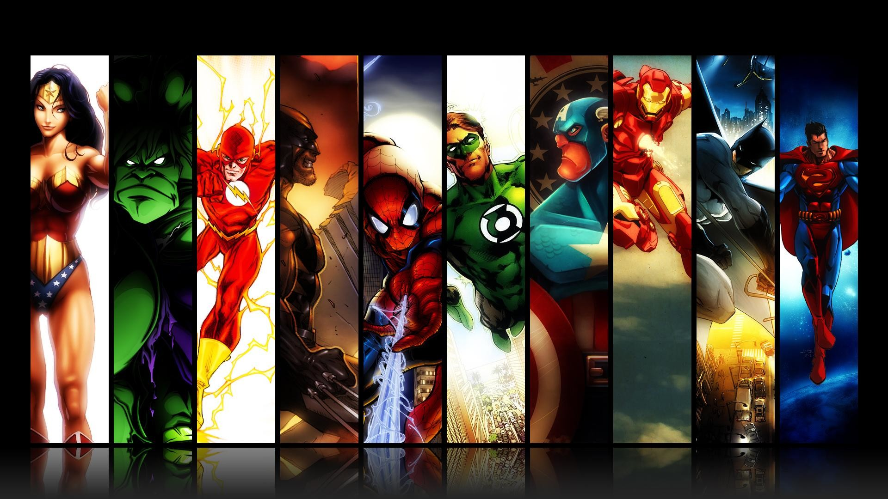

# Marvel Superheroes SPA

Este proyecto es una Single Page Application (SPA) desarrollada en Angular CLI que muestra información sobre los personajes de Marvel. Incluye una vista de inicio y una sección de héroes donde se muestran tarjetas con detalles de los superhéroes. Además, cuenta con un buscador que redirige a los componentes correspondientes.

## Contenido

1. [Requisitos](#requisitos)
2. [Instrucciones de instalación](#instrucciones-de-instalación)
3. [Uso](#uso)
4. [Características](#características)
5. [Contribución](#contribución)

## Requisitos

Asegúrate de tener instalados los siguientes requisitos antes de comenzar:

- [Node.js](https://nodejs.org/) (versión recomendada)
- [Angular CLI](https://angular.io/guide/setup-local) (para instalarlo, ejecuta  `npm install -g @angular/cli`)

## Instrucciones de instalación

1. Clona este repositorio en tu máquina local:

git clone https://github.com/mfrb15/Marvel-DC.git
1. Navega al directorio del proyecto: 

cd marvel-superheroes-spa

2. Instala las dependencias del proyecto:

 `npm install`

## Uso
Una vez que hayas completado la instalación, puedes ejecutar la aplicación con el siguiente comando:

 `ng serve`

Esto iniciará un servidor de desarrollo. Abre tu navegador y navega a http://localhost:4200/ para ver la aplicación en funcionamiento.

## Características
Vista de Inicio: La aplicación se inicia con una página de inicio que da la bienvenida a los usuarios.

Sección de Héroes: En la sección de héroes, los usuarios pueden ver tarjetas con información detallada sobre superhéroes de Marvel. Las tarjetas contienen imágenes, nombres y descripciones de los personajes.

Buscador: El buscador permite a los usuarios buscar superhéroes por nombre. Al ingresar un nombre en el campo de búsqueda y presionar "Buscar", se redirigirá a los usuarios a la página correspondiente con los resultados de la búsqueda.

## Contribución
Si deseas contribuir a este proyecto, ¡te damos la bienvenida! Puedes realizar una solicitud de extracción (pull request) con tus mejoras o correcciones. Asegúrate de seguir las pautas de contribución del proyecto.

¡Disfruta explorando el mundo de los superhéroes de Marvel con esta aplicación!

